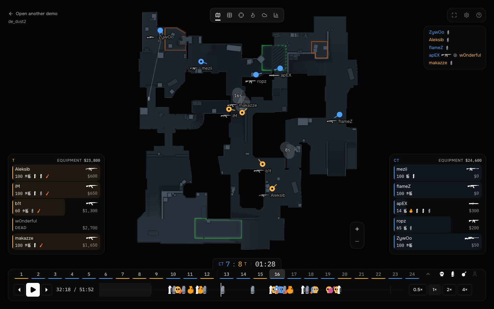
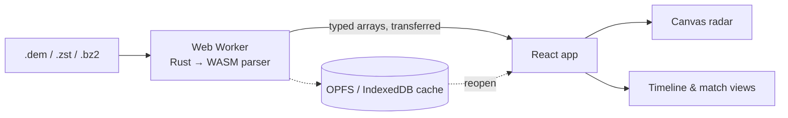

# disalytics

Review a Counter-Strike 2 match in ten minutes instead of forty — right in the browser, without
uploading the demo anywhere.

**[Open the app →](https://disalytics.disa-67b.workers.dev)** · English and Russian · installable, works offline



## Features

- **Private by design** — the `.dem` is parsed by Rust compiled to WebAssembly in a Web Worker; no
  server, no account, no upload
- **Opens what you have** — `.dem`, FACEIT `.dem.zst`, Valve `.dem.bz2`; drop a file, pick it, or
  double-click it once the app is installed
- **2D radar** — players, facing, weapons, health, flashes, smokes and fires, grenade flights,
  tracers, audible radius; zoom and pan
- **Round timeline** — every kill, grenade and objective as a glyph you can filter and jump to;
  play at 0.5×–4×, hold an arrow to scrub
- **Whole-match views** — scoreboard with per-round detail, duel map, heat map, utility map
- **Library** — parsed demos reopen instantly from the browser's storage; two professional sample
  matches to try without a demo of your own
- **Keyboard first**, colour-blind palette, reduced-motion support

## How it works



## Run it locally

Requires [Bun](https://bun.com) 1.3+ and, for the first build, Rust with `wasm-pack`
(`rust-toolchain.toml` pins the rest).

```bash
bun install
bun run wasm:build   # once per parser change
bun run dev
```

Monorepo: `apps/web` (the SPA), `packages/*` (schema, parser client, storage, map data, i18n, UI),
`crates/*` (the Rust parser). The full command list, rules and architecture are in
[`AGENTS.md`](AGENTS.md); workflow in [`CONTRIBUTING.md`](CONTRIBUTING.md);
plans in [issues and milestones](https://github.com/oleksii-latyshev/disalytics/milestones).

## Credits

- [`LaihoE/demoparser`](https://github.com/LaihoE/demoparser) (MIT) — the parser, vendored and patched in [`vendor/`](vendor/README.md)
- [`MurkyYT/cs2-map-icons`](https://github.com/MurkyYT/cs2-map-icons) — radar images and overview data
- [`Juknum/counter-strike-icons`](https://github.com/Juknum/counter-strike-icons) — weapon, utility and armour outlines
- [HLTV](https://www.hltv.org/) — the IEM Atlanta 2026 sample matches, shipped as parses, never as demos
- [`shadcn/ui`](https://github.com/shadcn-ui/ui) (MIT) — component source in `packages/ui`

Counter-Strike 2, the `.dem` format and the map and weapon art are Valve Corporation's. disalytics is
an unofficial tool, not affiliated with or endorsed by Valve.
