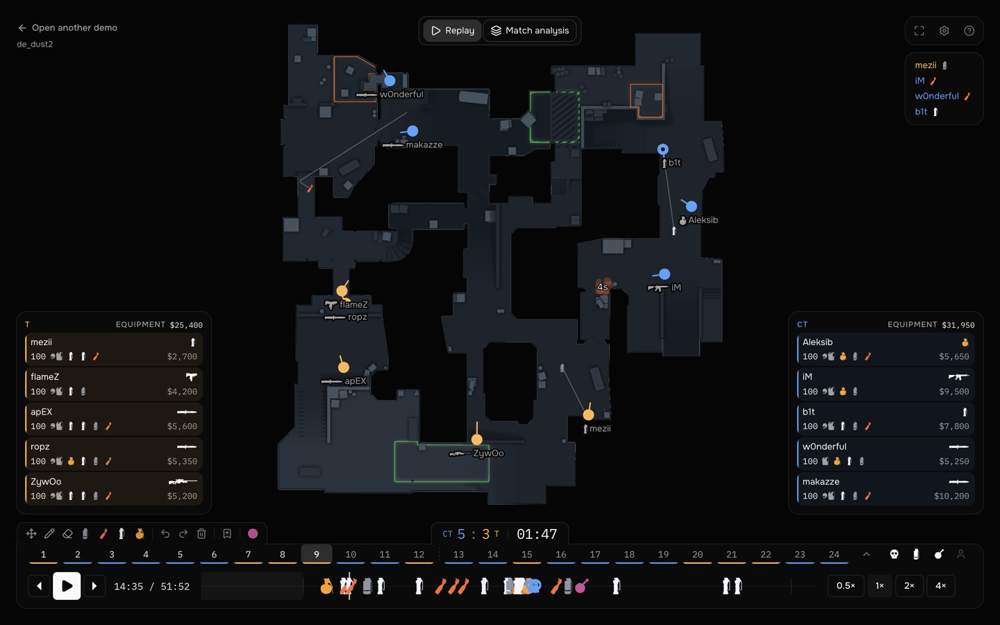
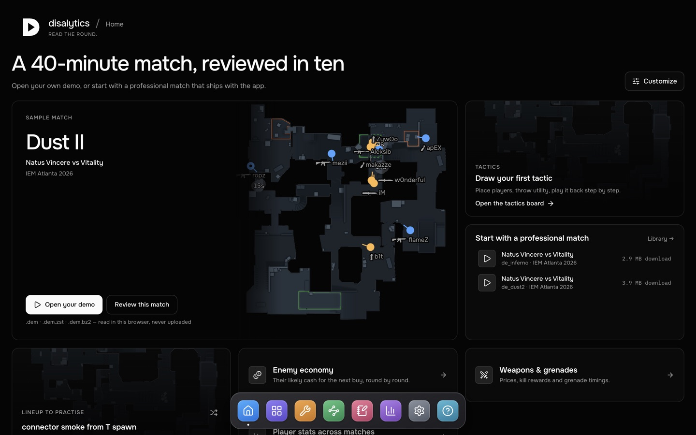
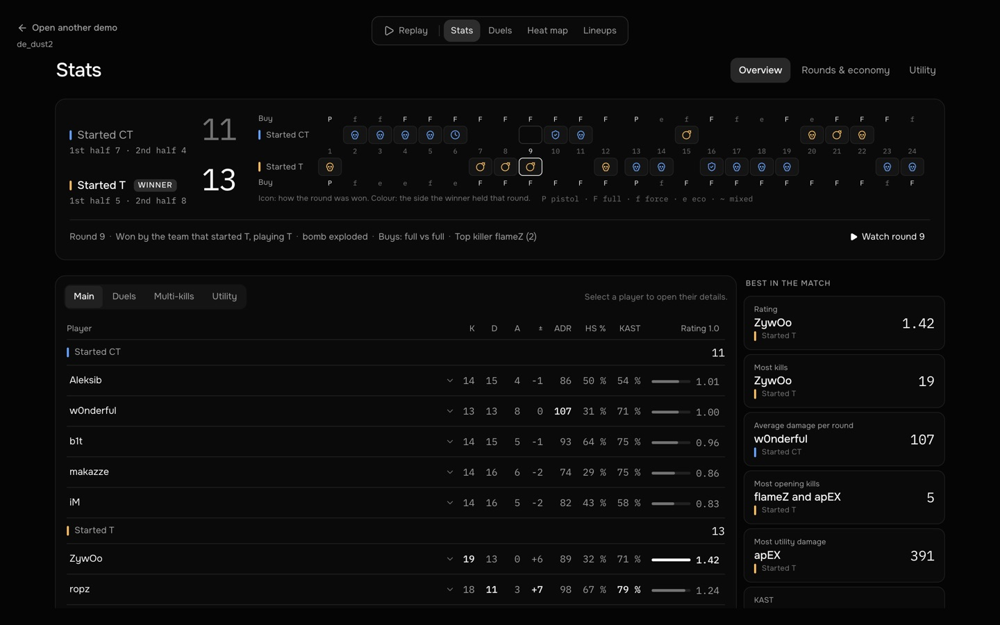
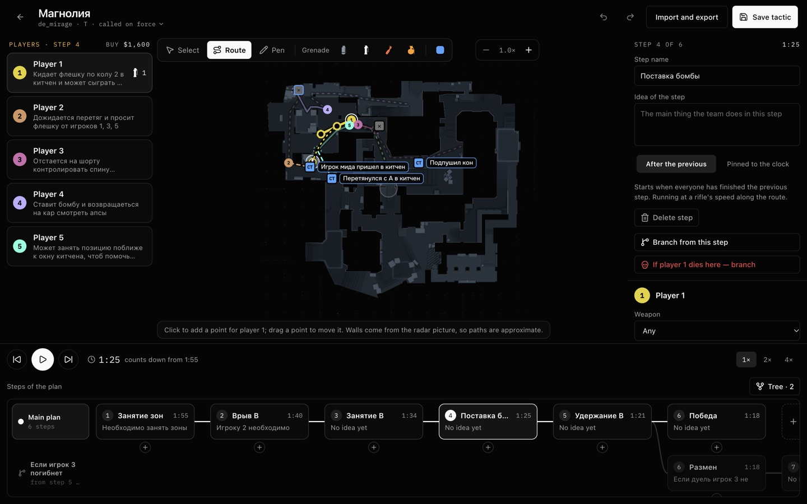
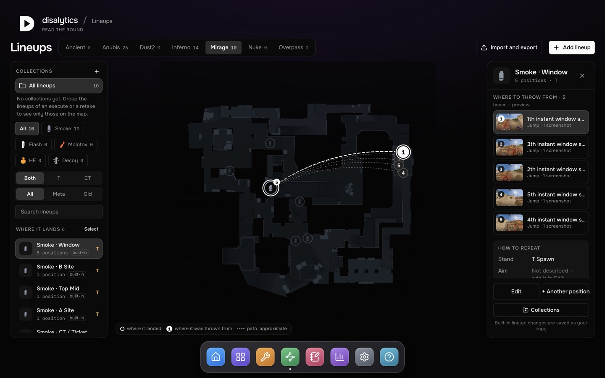
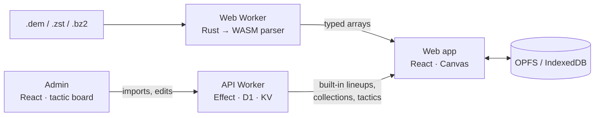

# disalytics

Review a Counter-Strike 2 match in ten minutes instead of forty — in the browser, without uploading
the demo anywhere.

**[Open the app →](https://disalytics.disa-67b.workers.dev)** · English and Russian · installable,
works offline



| | |
|---|---|
|  **Home** — open a demo or a shipped pro match |  **Stats** — rounds, economy, ratings, best players |
|  **Tactics** — draw a play, branch it, play it back |  **Lineups** — where to throw from, with screenshots |

## What it does

- **Replay** — 2D radar with players, utility, tracers and a filterable round timeline; 0.5×–4×
- **Match views** — stats, duels, heat map, and the lineups thrown in the match
- **Tactics and lineups** — a board for plays and a lineup library, with built-ins from the site
- **Private by design** — `.dem`, `.dem.zst`, `.dem.bz2` are parsed by Rust → WebAssembly in a Web
  Worker; no demo byte ever reaches a server

## How it fits together


```mermaid
flowchart LR
  dem[".dem / .zst / .bz2"] --> worker["Web Worker<br/>Rust → WASM parser"]
  worker -->|typed arrays| web["Web app<br/>React · Canvas"]
  web <--> cache[("OPFS / IndexedDB")]
  api["API Worker<br/>Effect · D1 · KV"] -->|built-in lineups,<br/>collections, tactics| web
  admin["Admin<br/>React · tactic board"] -->|imports, edits| api
```

The web app and the API are separate Cloudflare Workers; the API only ever holds metadata and
photos, never a demo.

## Run it locally

Requires [Bun](https://bun.com) 1.3+ and, for the first build, Rust with `wasm-pack`.

```bash
bun install
bun run wasm:build   # once per parser change
bun run dev          # http://localhost:5173
```

The admin and API run with `wrangler dev` — see [`apps/admin/README.md`](apps/admin/README.md).

## Links

- [`AGENTS.md`](AGENTS.md) — rules, architecture and every command
- [`CONTRIBUTING.md`](CONTRIBUTING.md) — issue → PR workflow
- [`docs/PARSER.md`](docs/PARSER.md) — the parser
- [Milestones](https://github.com/oleksii-latyshev/disalytics/milestones) — what is next

## Credits

[`LaihoE/demoparser`](https://github.com/LaihoE/demoparser) (MIT, vendored in [`vendor/`](vendor/README.md)) ·
[`MurkyYT/cs2-map-icons`](https://github.com/MurkyYT/cs2-map-icons) ·
[`Juknum/counter-strike-icons`](https://github.com/Juknum/counter-strike-icons) ·
[HLTV](https://www.hltv.org/) sample matches (shipped as parses, never as demos) ·
[`shadcn/ui`](https://github.com/shadcn-ui/ui) (MIT).
Counter-Strike 2 and its art are Valve Corporation's; disalytics is unofficial and not endorsed by
Valve.

## License

[AGPL-3.0-or-later](LICENSE). Code in `vendor/` keeps its upstream MIT licence
([`vendor/LICENSE`](vendor/LICENSE)).
